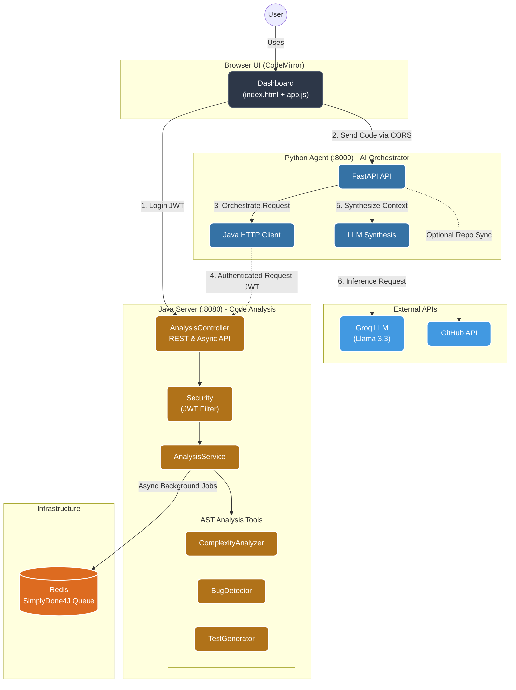

# CodeCritic

CodeCritic is a hybrid agentic code-review system that combines a Python LLM orchestrator with Java-based analysis tools.

The design goal is practical, not decorative: the Python layer plans and synthesizes reviews, while the Java layer performs deterministic analysis on Java source code using AST parsing, static bug heuristics, and best-effort SpotBugs integration.

## Why this architecture

- Python is used for orchestration because the LLM ecosystem is strongest there.
- Java is used for the analysis engine because JavaParser and SpotBugs are JVM-native and a natural fit for Java source analysis.
- HTTP is used between services to keep the system simple, debuggable, and language-agnostic.
- DTOs are kept separate from implementation logic so transport contracts remain stable and easy to reason about.

## High-level flow

1. The user opens the unified dashboard at `http://localhost:8080/` and signs in with the dashboard credentials (`admin`/`admin` by default).
2. The dashboard calls the Java server's `POST /api/auth/login`, receives a signed JWT, and stores it in `localStorage`. Every later `/api/**` call carries it in the `Authorization: Bearer` header.
3. Review, repository, and debugging workflows live in three tabs on the same page, backed by a CodeMirror editor.
4. Deterministic analysis runs on the Java service: complexity metrics, bug heuristics with best-effort SpotBugs, and JUnit 5 scaffolds.
5. The Python agent orchestrates the LLM backend (Groq primary, OpenAI fallback) to synthesize a human-readable code review and a complete JUnit test suite.
6. Optional Python-only workflows: GitHub repository ingestion with an architecture/risk roadmap, and error-log + source-code debugging diagnosis.

## Premium Code Editor

CodeCritic features a "sandboxed editor" experience using **CodeMirror**.
- **Syntax Highlighting**: Real-time coloring for Java source.
- **Line Numbering**: Essential for mapping static analysis findings to code.
- **IDE Feel**: Bracket matching, indentation, and responsive code editing within the browser.

## Algorithms and analysis methods

### 1. Complexity analysis

The `/api/complexity` endpoint uses JavaParser to parse the submitted source into an AST.

Cyclomatic complexity is estimated by counting decision points in the method tree:
- `if`
- `for`
- `foreach`
- `while`
- `do`
- `catch`
- `switch` cases
- ternary expressions
- boolean `&&` and `||`

The implementation tracks the maximum method complexity found in the file. Cognitive complexity is derived as a simple scaled estimate from cyclomatic complexity. If parsing fails, the service falls back to a lightweight token-based heuristic so it still returns a useful answer.

### 2. Bug detection

The `/api/bugs` endpoint combines two layers:

- Pattern-based detection for obvious risks such as:
  - division by zero
  - potentially unsafe `.toString()` calls
- Best-effort SpotBugs execution on compiled temporary classes if the environment has:
  - a JDK available
  - `spotbugs` on PATH

This gives a useful baseline even when SpotBugs is unavailable, while still allowing richer analysis in a proper dev environment.

### 3. Test generation

The `/api/generate-test` endpoint builds a deterministic JUnit 5 scaffold from the requested method metadata.

If the full source is provided, the Java service parses the class and tries to extract the real method signature and parameter types. Primitive types get simple placeholder values:
- `int`, `long`, `short` -> `1`
- `double`, `float` -> `1.0`
- `boolean` -> `true`
- everything else -> `null`

The Python endpoint `POST /generate-tests` uses the LLM to generate a complete JUnit 5 test suite with assertions and edge-case coverage, using Java analysis findings as context.

### 4. LLM synthesis

The Python side collects the tool outputs and sends a concise summary to the configured LLM provider.

Primary backend:
- Groq API via `GROQ_API_KEY`

Fallback:
- OpenAI via `OPENAI_API_KEY`

The LLM is used for synthesis and explanation, not for performing the actual static analysis.

### 5. Repository analysis and debugging

- `POST /analyze-repository` downloads a GitHub repository archive, runs the deterministic Java analysis per file (complexity + bug findings), derives repository-level metrics in Python - complexity hotspots, largest files, bug totals, package distribution - and only then asks the LLM to turn those real numbers into a production-readiness summary.
- `POST /debug` combines source code, error logs, and static findings (complexity + bugs) into root-cause diagnosis plus concrete fix guidance. Same hybrid pattern: deterministic analysis first, LLM synthesis second.

## Repository layout

- `java-server/` - Spring Boot analysis microservice
  - `com.codecritic.analysis/` - complexity analysis, bug detection (heuristics + optional SpotBugs), JUnit 5 test generation, and an `AnalysisStrategyFactory` that maps an `AnalysisType` to the right implementation
  - `com.codecritic.job/` + `com.codecritic.event/` - `JobCoordinator` interface over the simplydone4j queue and job lifecycle events (queued, completed, failed) used for logging
  - `com.codecritic.security/` - JWT token provider and authentication filter
  - `com.codecritic.controller/` - `AnalysisController` (sync + async job endpoints), `AuthController`, `FrontendController`
  - `src/main/resources/templates/index.html` + `static/` - unified dashboard (Review / Repository / Debug tabs)
- `python-agent/` - LLM orchestrator and HTTP tool wrappers
- `docker-compose.yml` - local multi-container setup
- `.env.example` - environment variable template
- `LICENSE` - MIT license for portfolio use

## How the pieces fit together



- The Java server exposes a REST API for deterministic analysis (`/api/complexity`, `/api/bugs`, `/api/generate-test`) plus async job variants (`/api/jobs/*`) backed by the simplydone4j queue.
- `AnalysisServiceImpl` is the single entry point used by the controller. Adding a new analysis type means implementing an `AnalysisStrategy` and registering it in `AnalysisStrategyFactory` - the controller and service layer do not change.
- Bug detection always runs pattern heuristics and adds SpotBugs findings when the CLI is available - it never blocks on it. SpotBugs results are cached by source hash (SHA-256 + detector version) so repeated analysis of identical code skips recompilation.
- The Python agent is a thin FastAPI layer: it calls the Java endpoints (authenticating with the same credentials as the dashboard), then sends the combined findings to the LLM (Groq primary, OpenAI fallback) for the final review.
- Both services expose metrics: the Java server tracks per-analysis request counts and latency plus SpotBugs execution time (`GET /api/metrics`), and the Python agent tracks request/status/latency (`GET /metrics`).
- Auth is stateless JWT: `POST /api/auth/login` issues a token, and a servlet filter validates it on every other `/api/**` request. Secrets come from environment variables.
- Both services log structured JSON and the Python agent pings the Java `/health` endpoint on startup before accepting traffic.

## Sample analysis report

See [docs/sample-analysis-report.md](docs/sample-analysis-report.md) for a real repository-analysis output (produced against a public GitHub repository) showing the deterministic metrics and the LLM summary.

## Environment variables

Create a local `.env` file from `.env.example` and fill in real values locally.

Required:
- `GROQ_API_KEY` - Groq API key

Optional:
- `OPENAI_API_KEY` - fallback LLM key
- `GROQ_MODEL` - Groq model id (default `llama-3.3-70b-versatile`)
- `OPENAI_MODEL` - OpenAI fallback model id
- `JAVA_SERVER_URL` - defaults to `http://localhost:8080/api`
- `GITHUB_TOKEN` - optional token for private repos and higher API limits
- `CORS_ALLOW_ORIGINS` - allowed origins for browser access to Python endpoints
- `AUTH_USERNAME` / `AUTH_PASSWORD` - shared credentials for the dashboard login and for the Python agent to authenticate against the Java API (default `admin`/`admin`)
- `JWT_SECRET` - signing secret for JWT tokens (min 32 bytes for HS256)
- `JWT_EXPIRATION_MS` - token lifetime in milliseconds (default 24h)
- `RATE_LIMIT_REQUESTS` - requests allowed per window per IP
- `RATE_LIMIT_WINDOW_SECONDS` - rate-limit window length
- `MAX_REQUEST_BYTES` - max inbound payload size in bytes
- `LLM_TIMEOUT_SECONDS` - LLM call timeout (default `60`)

Example:

```bash
GROQ_API_KEY=your_groq_key
OPENAI_API_KEY=your_openai_key
JAVA_SERVER_URL=http://localhost:8080/api
GITHUB_TOKEN=your_github_token_optional
CORS_ALLOW_ORIGINS=*
AUTH_USERNAME=admin
AUTH_PASSWORD=admin
JWT_SECRET=codecritic-demo-secret-key-change-me-in-production-0123456789
RATE_LIMIT_REQUESTS=60
RATE_LIMIT_WINDOW_SECONDS=60
MAX_REQUEST_BYTES=1500000
```

## Real-World Usable (v1.0)

CodeCritic has been hardened to transition from a demo-quality project to a genuinely usable tool for small teams and staging environments.

### Core Reliability Features
- **Concurrency Safety**: The Java server now uses `UUID`-based temporary directory isolation for every SpotBugs analysis, preventing resource collisions during parallel reviews.
- **SpotBugs Result Cache**: Repeated analysis of identical source replays the cached result instead of recompiling and re-running SpotBugs. The key is a SHA-256 of the source plus a detector version, so bumping the version invalidates everything; the cache is bounded to 256 entries.
- **Metrics**: The Java server tracks per-analysis request counts and latency, plus SpotBugs execution time (`GET /api/metrics`); the Python agent tracks request counts, status codes, and latency percentiles (`GET /metrics`).
- **Startup Dependency Checks**: The Python agent includes an asynchronous startup task that pings the Java server's `/health` endpoint with a retry policy. It ensures all downstream dependencies are UP before accepting traffic.
- **Input Validation**: Added early-reject heuristics to validate Java source code structure, preventing LLM token waste on invalid inputs.
- **LLM Hardening**: Configurable timeouts (`LLM_TIMEOUT_SECONDS`) and exponential backoff retries for all AI provider calls.

### Observability (Structured Logging)
Both the Python Agent and Java Server are now configured for **Structured JSON Logging**:
- **Python**: Uses `python-json-logger` with `request_id` correlation.
- **Java**: Uses `logback-spring.xml` with the `logstash-logback-encoder`.
This allows logs to be easily ingested and filtered in tools like ELK, Datadog, or simple `jq` searches.

---

## License
MIT

## Run locally without Docker

Prerequisites: JDK 21, Maven 3.9+, Python 3.11+. Start the Python agent first, then the Java server (the agent pings the Java health endpoint on startup). If you enable the scheduler (`SIMPLYDONE4J_SCHEDULER_ENABLED=true`), Redis must be running; otherwise set it to `false` to avoid connection errors.

### Python agent

```bash
cd python-agent
python -m venv venv
source venv/bin/activate  # Windows: .\venv\Scripts\activate
pip install -r requirements.txt
python -m uvicorn app:app --host 0.0.0.0 --port 8000
```

The agent reads `GROQ_API_KEY` from `.env` at the repo root (or the environment). Verify it is connected: `GET http://localhost:8000/ready` should return `"llmConnectivity":{"ok":true}`.

### Java server

```bash
cd java-server
mvn package
java -jar target/java-server-0.1.0.jar
```

Then open `http://localhost:8080/` and sign in with the configured credentials (default `admin` / `admin`).

Notes:
- The Java server utilizes Redis for the asynchronous job queue (`simplydone4j`). The queue scheduler is enabled by default locally; Redis is required when the scheduler is on. On Render, the scheduler is disabled by default to stay within the 512 MB free-tier limit. Local deployments via Docker Compose spin up a memory-capped Redis container to handle these jobs efficiently.
- On Render (or any other host), the dashboard finds the Python agent via `GET /api/config`; set `PYTHON_AGENT_URL` when the agent is not on `localhost:8000`.

## Run with Docker

```bash
docker compose up --build
```

Then open:
- Python agent health: `http://localhost:8000/health`
- Python metrics endpoint: `GET http://localhost:8000/metrics`
- Python review API: `POST http://localhost:8000/review`
- Python full test generation API: `POST http://localhost:8000/generate-tests`
- Python repository analysis API: `POST http://localhost:8000/analyze-repository`
- Python debug assistant API: `POST http://localhost:8000/debug`
- Python readiness API (LLM connectivity): `GET http://localhost:8000/ready`
- Java health: `http://localhost:8080/health`
- Java login API: `POST http://localhost:8080/api/auth/login`
- Java metrics API: `GET http://localhost:8080/api/metrics` (requires JWT)
- Java complexity API: `POST http://localhost:8080/api/complexity` (requires JWT)
- UI dashboard: `http://localhost:8080/` - sign in, then use the Review, Repository, and Debug tabs

## Deploy to Render

A ready-to-use blueprint (`render.yaml`) deploys both services on Render's free tier:

1. Push this repo to GitHub.
2. On render.com: **New → Blueprint** and select the repo. Render reads `render.yaml` and creates two web services.
3. Set the two secrets it prompts for (`GROQ_API_KEY`, and optionally `GITHUB_TOKEN`). `JWT_SECRET` is auto-generated.
4. URLs: Java = `https://codecritic-java.onrender.com`, Python = `https://codecritic-python.onrender.com`. The dashboard auto-detects the agent URL from `/api/config`.

What the blueprint does:

- **Region `singapore`** — the closest Render region to India (Render has no Mumbai region).
- **Free plan, hard memory caps** — the JVM is capped (`-Xmx256m`, metaspace 128m, code cache 64m, `UseSerialGC`, exit-on-OOM) and the executor pool is capped (1 core / 2 max / 20 queue), so nothing grows into the 512 MB free limit. `MAVEN_OPTS=-Xmx512m` keeps the container build inside the same budget.
- **No Redis on Render by default** — scheduler and monitoring are disabled (`SIMPLYDONE4J_SCHEDULER_ENABLED=false`, `SIMPLYDONE4J_MONITORING_ENABLED=false`) so nothing grows into the 512 MB limit. Add an Upstash `REDIS_URL` and flip these to `true` if you need async jobs.
- **Health checks** on `/health` for both services.

Free-tier caveats: instances sleep after 15 minutes of inactivity (first request after a nap takes ~30-60s to boot), and the 750 free hours per month are shared between both services (~375 hours each). Upgrade either service to a paid plan if you need always-on.

## API examples

### Get a token

All Java `/api/**` endpoints require a JWT. Obtain one with the configured dashboard credentials:

```bash
curl -X POST http://localhost:8080/api/auth/login \
  -H "Content-Type: application/json" \
  -d '{"username":"admin","password":"admin"}'
```

The response is `{"token":"<jwt>"}`. Export the token for the examples below:

```bash
export TOKEN="<jwt>"
```

### Java: complexity

```bash
curl -X POST http://localhost:8080/api/complexity \
  -H "Content-Type: application/json" \
  -H "Authorization: Bearer $TOKEN" \
  -d '{"code":"public class A { public int f(int x){ if(x>0){ return x; } return 0; } }"}'
```

### Java: bugs

```bash
curl -X POST http://localhost:8080/api/bugs \
  -H "Content-Type: application/json" \
  -H "Authorization: Bearer $TOKEN" \
  -d '{"code":"public class A { public int f(int x){ return 10 / x; } }"}'
```

### Java: generate test

```bash
curl -X POST http://localhost:8080/api/generate-test \
  -H "Content-Type: application/json" \
  -H "Authorization: Bearer $TOKEN" \
  -d '{"className":"Calculator","methodName":"add","parameters":"int a, int b","code":"public class Calculator { public int add(int a, int b){ return a + b; } }"}'
```

### Java: async analysis job

Each analysis endpoint also has a job-based variant (`/api/jobs/complexity`, `/api/jobs/bugs`, `/api/jobs/generate-test`) backed by simplydone4j:

```bash
curl -X POST http://localhost:8080/api/jobs/complexity \
  -H "Content-Type: application/json" \
  -H "Authorization: Bearer $TOKEN" \
  -d '{"code":"public class A { public int f(int x){ return x; } }"}'
# -> {"jobId":"<id>", ...}

curl http://localhost:8080/api/jobs/<id> \
  -H "Authorization: Bearer $TOKEN"
```

### Python: review pipeline

```bash
curl -X POST http://localhost:8000/review \
  -H "Content-Type: application/json" \
  -d '{"code":"public class Calculator { public int divide(int a, int b){ return a / b; } }"}'
```

### Python: full test generation

```bash
curl -X POST http://localhost:8000/generate-tests \
  -H "Content-Type: application/json" \
  -d '{"code":"public class Calculator { public int add(int a, int b){ return a + b; } }"}'
```

### Python: analyze GitHub repository

```bash
curl -X POST http://localhost:8000/analyze-repository \
  -H "Content-Type: application/json" \
  -d '{"repoUrl":"https://github.com/octocat/Hello-World","maxFiles":10}'
```

### Python: debug assistant

```bash
curl -X POST http://localhost:8000/debug \
  -H "Content-Type: application/json" \
  -d '{"language":"java","code":"public class A { int f(int x){ return 10/x; } }","errorLog":"java.lang.ArithmeticException: / by zero"}'
```

## Testing and smoke checks

### Python integration test

```bash
cd python-agent
python integration_test.py
```

### Java smoke check

```bash
curl http://localhost:8080/health
```

Expected response:

```json
{"status":"ok","service":"java-server"}
```

### Java test suite

```bash
cd java-server
mvn test
```

The suite (39 tests) covers:
- JWT generation, parsing, and validation (`JwtTokenProviderTest`)
- the login flow and credential handling (`AuthServiceImplTest`, `AuthControllerTest`)
- the full security chain, including a real login followed by an authenticated request (`SecurityIntegrationTest`)
- bug heuristics and deterministic test-scaffold generation (`PatternBugDetectorTest`, `JavaParserTestGeneratorTest`)
- analysis strategy resolution (`AnalysisStrategyFactoryTest`)
- the SpotBugs result cache (replay, key stability, stats) (`CachedSpotBugsBugDetectorTest`)
- the metrics registry (counts, averages, SpotBugs timing) (`AnalysisMetricsTest`)
- the existing controller and service contracts (`AnalysisControllerTest`, `AnalysisServiceImplTest`)

## Docker notes

- The Java image is built in a multi-stage Dockerfile so the jar is created inside the container build.
- The Python image starts a FastAPI server with Uvicorn so the container stays alive and exposes HTTP endpoints.
- The compose file wires `JAVA_SERVER_URL=http://java-server:8080/api` so the Python container talks to the Java container over the Docker network.
- Redis is configured from `REDIS_URL` (the compose file uses `redis://redis:6379`); `REDIS_HOST`/`REDIS_PORT` are no longer read.
- Both Dockerfiles build from the repository root, so the same files work for `docker compose` and Render.

## Troubleshooting

### Java health returns 404

That means the service was running but the root health endpoint was missing. This repo now includes `GET /health` on the Java server.

### SpotBugs is unavailable

The `/api/bugs` endpoint still works. It returns pattern-based findings and includes a best-effort SpotBugs message if the CLI is not present.

### Groq key missing

Set `GROQ_API_KEY` in your `.env` or shell environment. If Groq is unavailable, the Python wrapper can fall back to `OPENAI_API_KEY` if configured.

### Python review fails but health works

This usually means the agent is running, but the review path could not reach the Java service or the LLM key is missing. Check `JAVA_SERVER_URL`, `GROQ_API_KEY`, and the container logs.

## Best practices used

- DTOs for transport, not persistence.
- Small, focused services and controllers.
- Fail-soft analysis where external tooling is optional.
- Stateless JWT authentication with environment-injected secrets, never hard-coded keys.
- Multi-stage Docker builds for smaller runtime images.
- Minimal health endpoints for reliable smoke testing.
- Unit and integration tests for security, analysis, and factory wiring.

## Security model

The Java API is protected by stateless JWT authentication:

- `POST /api/auth/login` validates the configured `AUTH_USERNAME`/`AUTH_PASSWORD` and returns a signed HS256 JWT (jjwt), valid for `JWT_EXPIRATION_MS` (default 24h).
- Every other `/api/**` endpoint requires `Authorization: Bearer <token>`; invalid or missing tokens get a `401` JSON response.
- Public paths are limited to `/api/auth/login`, `/health`, `/ready`, static assets, and the dashboard page.
- The signing secret comes from `JWT_SECRET` (min 32 bytes for HS256); a demo default is used only for local development, never for production.

Beyond auth, this project is a local-development and demo tool, not a public internet service:

- The Java backend accepts raw Java source over HTTP.
- The bug-analysis path may compile that source in a temporary directory.
- SpotBugs is invoked as an external best-effort process when available.
- That design is fine for local demos and interviews, but it is not hardened against malicious input.

See [SECURITY.md](SECURITY.md) for the full threat model and secrets guidance.

## Demo flow

1. Start the stack with `docker compose up --build`.
2. Open `http://localhost:8080/` and sign in (`admin`/`admin` by default).
3. Paste a small Java class into the editor on the Review tab and run the analysis.
4. Observe:
   - complexity metrics from the Java parser
   - bug warnings from heuristics and SpotBugs fallback
   - a deterministic JUnit 5 scaffold and an LLM-generated full test suite
   - a final LLM-written review
5. Switch to the Repository tab to analyze a GitHub repository, or the Debug tab to diagnose an error log.

Example input:

```java
public class Calculator {
  public int divide(int a, int b) {
    return a / b;
  }
}
```

Expected behavior:
- `/api/complexity` reports a cyclomatic complexity greater than 1.
- `/api/bugs` flags the division risk or a SpotBugs-style finding.
- `/api/generate-test` returns a deterministic JUnit scaffold.
- `/generate-tests` returns a complete LLM-generated JUnit suite.
- `/review` returns a synthesized human-readable code review with generated tests embedded.
