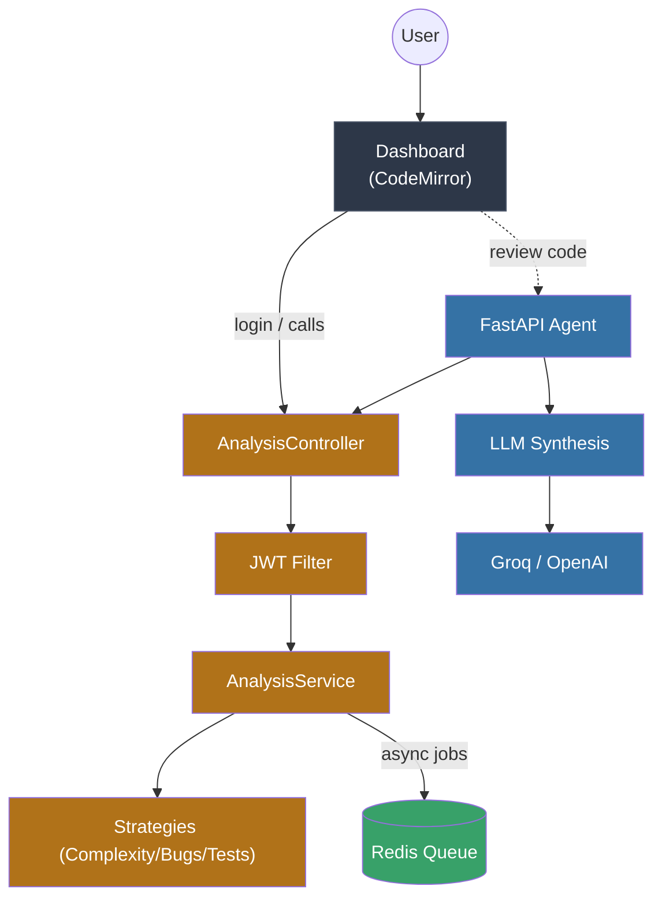

# Architecture

CodeCritic is split into two services connected over HTTP: a **Java analysis engine** and a **Python LLM orchestrator**. This split keeps deterministic analysis on the JVM (where JavaParser and SpotBugs live) and AI orchestration in Python (where the LLM ecosystem is strongest).

## Services

| Service | Stack | Responsibility |
|---------|-------|----------------|
| `java-server` | Spring Boot 3, Java 21, JavaParser, SpotBugs, jjwt | Deterministic analysis: complexity, bug detection, JUnit scaffolds; auth; optional Redis-backed async jobs |
| `python-agent` | FastAPI, Pydantic, httpx | Orchestrates the Java service, then synthesizes reviews/test-suites via an LLM (Groq primary, OpenAI fallback) |

## Control flow



## Java layer (the analysis engine)

The controller layer only talks to `AnalysisService`, a thin facade:

- `AnalysisServiceImpl` delegates each concern:
  - Complexity → `ComplexityAnalyzer` (Strategy)
  - Bugs → `BugDetector` (Composite of pattern + cached SpotBugs)
  - Tests → `TestGenerator` (Strategy)
  - Jobs → `JobCoordinator` (Adapter over SimplyDone4J)

New analysis types are added by implementing an `AnalysisStrategy` and registering it in `AnalysisStrategyFactory`; the controller and service layers never change (Open/Closed Principle).

### Thread-safety & concurrency

- **SpotBugs isolation**: each run writes to a fresh `UUID` temp directory (`SpotBugsRunner`), preventing collisions under parallel reviews.
- **SpotBugs cache**: `CachedSpotBugsBugDetector` keys results by SHA-256 of source + detector version. It is a synchronized, access-ordered `LinkedHashMap` bounded to 256 entries with LRU eviction, so repeated analysis of identical code skips recompilation without unbounded memory growth.

### Idempotent async jobs

`SimplyDoneJobCoordinator.sha256Hex(jobType, payload)` derives a deterministic idempotency key by hashing the job type plus the payload keys **in sorted order**, so identical submissions always produce the same key regardless of map iteration order. Retrying the same submission returns the same key, so SimplyDone4J does not create duplicate work. The key remains deterministic even if SHA-256 is unavailable (it falls back to a deterministic hash rather than a random value).

The producer passed to the queue is the originating identity qualified by the job type (e.g. `alice-complexity-analysis`), so SimplyDone4J's per-producer rate limiter is not shared across unrelated job types from the same user. Idempotency still holds because the same user + job type + content yields the same producer + key.

Handlers are registered with the library at startup by `SimplyDoneHandlerRegistrar`; SimplyDone4J dispatches queued jobs only through its `HandlerRegistry`, so job types with no registered handler are rejected with "No handler registered".

## Python layer (the orchestrator)

`agent.py` provides typed HTTP wrappers (`get_complexity`, `find_bugs`, `generate_test`) that keep the Java calls mockable, plus the orchestration pipelines:

- `run_review_pipeline` — deterministic analysis → full LLM test suite → synthesized review
- `generate_full_test_suite` — JUnit suite with real assertions using findings as context
- `analyze_github_repository` — clone via codeload/API, per-file analysis, deterministic repo metrics, then LLM summary
- `analyze_debug_issue` — source + error log + static findings → root-cause diagnosis

`groq_llm.py` wraps LLM providers with retry (tenacity) on transient failures (network, 429, 5xx) and provider fallback. Provider-specific parsing is isolated here so the rest of the agent stays provider-agnostic.

## Observability

- Both services emit **structured JSON logs** (Java via `logstash-logback-encoder`, Python via `python-json-logger`) with request correlation ids.
- `GET /api/metrics` (Java) reports analysis counts, latency, SpotBugs timing, and cache hit/miss/`size`.
- `GET /metrics` (Python) reports request counts, status codes, and latency percentiles.

## Repository layout

```
java-server/src/main/java/com/codecritic/
  analysis/          Strategies + factory (complexity, bugs, tests)
  config/            Security, JWT, Redis, SimplyDone4J, CORS
  controller/        AnalysisController, AuthController, FrontendController
  dto/               Transport records
  event/             Job lifecycle events
  exception/         Global error handling
  job/               JobCoordinator adapter over SimplyDone4J
  metrics/           AnalysisMetrics registry
  model/ repository/ User entity + repository
  security/          JWT provider + auth filter
  service/           AnalysisService + AuthService facades
python-agent/
  app.py             FastAPI surface (CORS, rate limit, payload limits)
  agent.py           Tool wrappers + orchestration pipelines
  groq_llm.py        LLM provider wrapper (retry + fallback)
```
